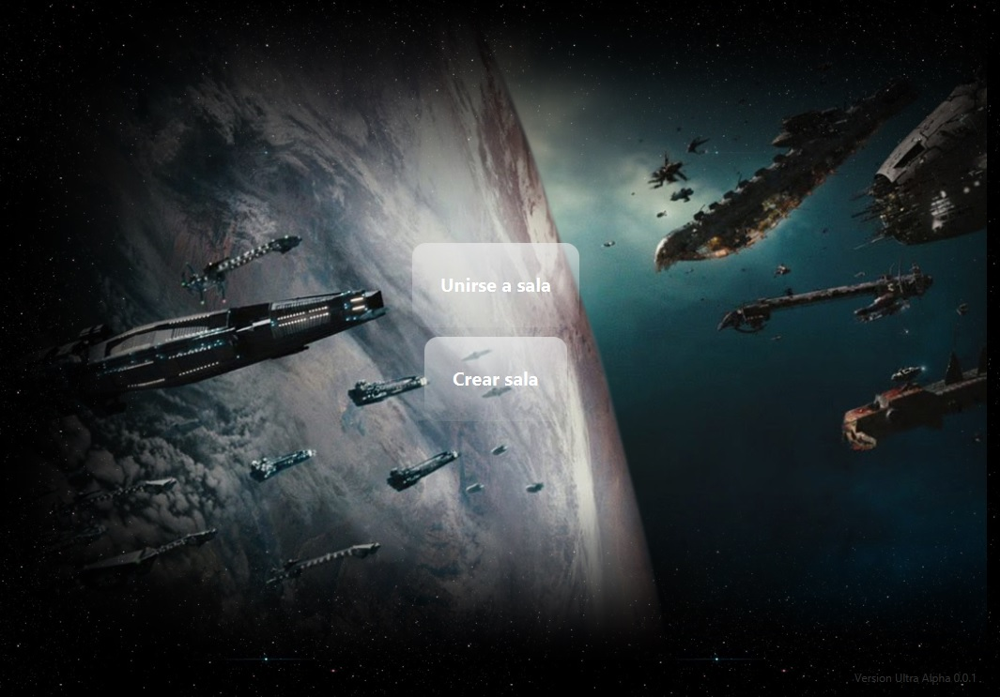
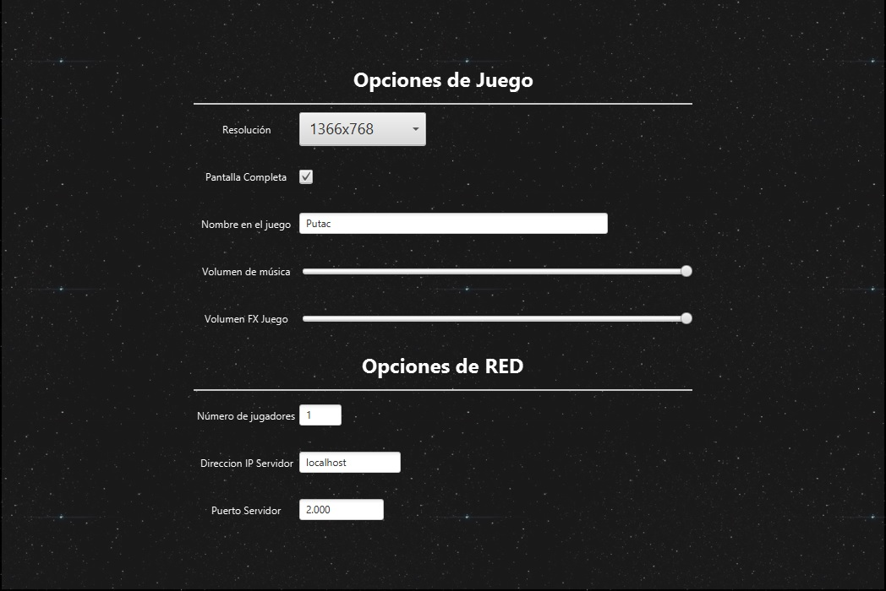
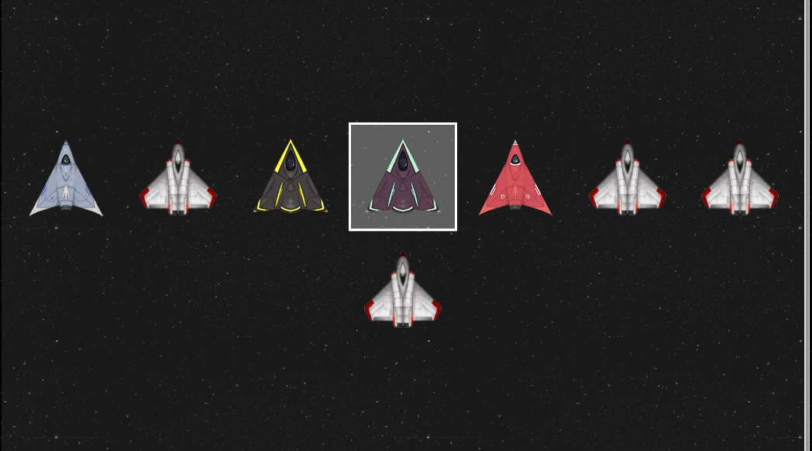

# JavaSpace

## Juego multijugador escrito en java y usando el motor FXGL

### Puntos clave

* Multijugador estilo battle royale
* Servidor embebido en el juego
* Sistema de físicas semirealista

## Manual de uso

### Presentación

​	Al abrir el juego la pantalla muestra el launcher, en el que podremos configurar los aspectos del funcionamiento del juego así como elegir con qué nave jugar, el nombre a usar... Ahora pasaremos a detallar más correctamente las diferentes secciones del launcher.

El launcher se compone de dos secciones. El menú, que se encuentra en la parte izquierda, y el contenido del mismo, que se enfocará en el centro-derecha.

Dentro del menú, encontramos varias secciones.

* #### Empezar partida: 
  En esta parte, nos encontraremos dos botones. El primero, será para unirse directamente a un servidor y el  segundo botón, que será crear servidor. Este nos permitirá actuar como servidor de una partida, y posteriormente, con el botón de arriba, nos uniremos a nuestro propio servidor.

  

* #### Configuración: 
  Aquí encontraremos todos los parámetros necesarios para poder jugar.

  

#### Resolución:
Determinará el tamaño de la ventana en la que jugamos.

#### Pantalla completa:
Esto nos eliminará todos los bordes de la ventana y junto a la resolución máxima, hará una pantalla completa real.

#### Nombre en el juego:
El nombre que usaremos para distinguirnos del resto de jugadores de la partida.

#### Volumen de música: 
Volumen que daremos a la música del Launcher y a la música ingame.

#### Volumen FX Juego: 
Volumen de los sonidos de botones y efectos propios del juego.

#### Número de jugadores: 
Cantidad de jugadores que se unirán a la partida. Esta opción es solo para el servidor y no tendrá efecto alguno si jugamos solo como cliente.

#### Dirección IP Servidor: 
Dirección de la máquina que ejecutará al servidor. Si es la nuestra propia, escribiremos "localhost".

#### Puerto servidor: 
Puerto por el que nos antenderá la máquina a la que nos conectamos. El servidor lo usará como puerto desde el que atenderá a las peticiones.

* #### Seleccionar Skin
  En esta sección podremos elegir la skin que deseemos usar para jugar nuestra partida. Ninguna de ellas ofrece ninguna ventaja al juego. Aunque no prometemos que las que vengan por DLC de pago tampoco lo hagan.

  

* #### Sobre nosotros
Sección dedicada a los creadores del juego, en ella encontrarás información sobre los desarrolladores.

* #### Salir
Pues eso, no creo que haga falta explicar esta. Pero por si acaso.... Solo tienes que pulsarlo para que salga de la partida.

### Cómo jugar

​	Para poder unirse a una partida es necesario introducir una dirección ip en la casilla correspondiente en la configuracion, así como el puerto. Para crear una sala de juego, solo es necesario el numero de puerto. La ip de la máqina que crea la sala debe ser compartida con el resto de jugadores, así como el puerto para que estos puedan configurar su cliente en consecuencia.

### Controles

​	Debido a que el juego presenta un movimiento semirealista, no hay pérdida de energía cinética en las naves, es decir, si se quiere frenar hay que propulsar la nave (W) en dirección contraria a su movimiento. Para orientar la nave se usan las teclas A y D, la velocidad angular también se conserva, pero se peude frenar presionando la tecla Q. Tanto la velocidad lineal como angular han sido limitadas para que el juego sea realmente jugable. Para usar el arma de la nave se pulsa la tecla de ESPACIO, hay que tener en consideración que el projectil es un láser, es decir, nos e ve afectado por la rotación de la nave.

### Partida

​	El juego sigue el famoso formato "Battle royale", en el que un número de jugadores se enfrentan entre todos y sólo el último vivo es el ganador. El campo de juego está limitado por unas franjas rojas, que al salirse de estas se recibe daño por segundo. Si la nave del jugador es derribada, se pasa al modo espectador, en el que puede ver en directo lo que está sucediendo desde el punto de vista de otros jugadores.

### HUD

El hud cuenta de varias secciones. 
Arriba al centro veremos nuestro nombre.
A la izquierda encontraremos un número que indica la velocidad. Justo debajo de ese número podemos observar un circulo que se rellena. Esto es la aceleración. A más relleno el círculo, mas fuerte será la aceleración de la nave.
A la derecha hay 3 barras. De arriba a abajo, la primera es nuestro escudo, la segunda la integridad estructural de la nave (HP), y la tercera es una pequeña barra para la regeneración de escudo. Cuando perdamos escudo, cada 3 segundos sin recibir daño regeneraremos una porción de este escudo. Esto es lo que nos indica esta barra.

## Instalación

### Dependencias

#### Git

https://git-scm.com/

#### Nametags

https://github.com/KevinDavidCabreraRodriguez/JavaSpace-ComponenteNombre

#### Minimapa/Radar

https://github.com/KevinDavidCabreraRodriguez/JavaSpaceRadar

#### HUD

https://github.com/RushTfe/JavaSpaceHUD

#### Otras dependencias:

#### FXGL

https://github.com/AlmasB/FXGL

#### Ini4J

https://github.com/qxo/ini4j

